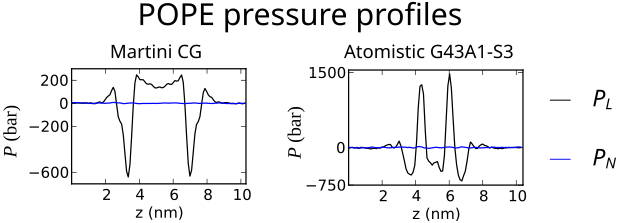
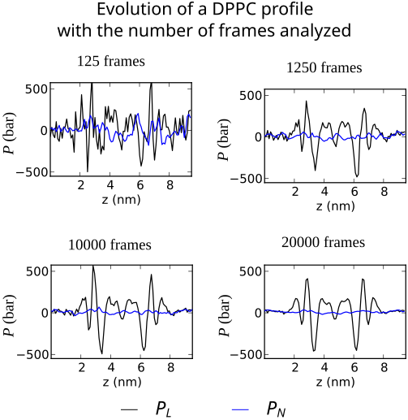
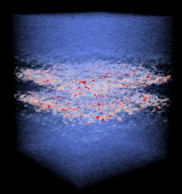
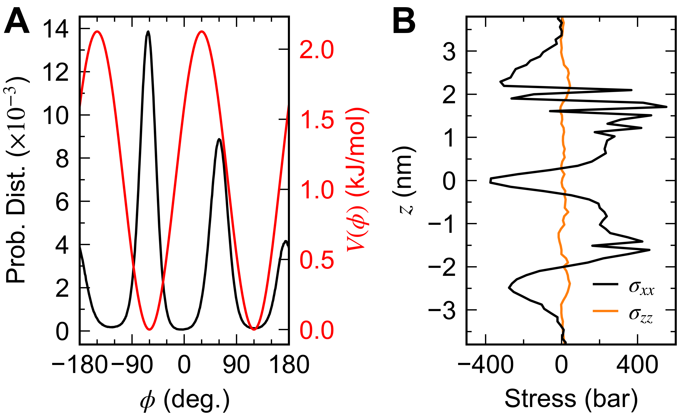

Frequently Asked Questions
==========================

Q1. How long does it take to analyze a trajectory with `gmx_LS mdrun`?

> This depends on the size of your system and the grid size. Analysis time increases with a larger system and a finer grid. For a typical system with approximately 100,000 atoms and a grid spacing of 0.1 nm it can take 5-10 minutes (depending on your hardware) to analyze each frame in the trajectory. The code does not utilize any of the SIMD or GPU optimizations that the vanilla GROMACS uses and therefore is much slower.

Q2. `gmx_LS mdrun -rerun` has been stuck on the first frame of the trajectory for hours, what's wrong?

> If the analysis is taking an unusually long time there may be something wrong with the input files or there may be an unknown problem with the code. You can check this by selecting to output only one of the components such as the kinetic one (using the `-lscont vel` flag), which should be done very quickly even for a large number of particles. If this fails there may be a problem with the trajectory, otherwise there may a particular problem with some of the interactions being calculated. You can try calculating some of the other individual components in order to narrow it down and contact us regarding a particular issue.

Q3. I get a segmentation fault when post-processing a trajectory with `gmx_LS mdrun -rerun`

> Make sure that `mdrun_LS` is run in a different folder than where the input trajectory is at, otherwise the program may inadvertently overwrite the input trajectory and cause the error.

Q4. Can the program be run in parallel? 

> The latest development version of GROMACS-LS is now capable of running using multiple threads using the bult-in thread-MPI capability of GROMACS. The stable version only runs serially. However, each frame in a trajectory can be analyzed completely independent of every other frame. One method to parallelize the analysis is to separate the trajectory into smaller chunks with equal number of frames (using `gmx_LS trjconv -split`), and analyze each chunk separately. You can then average all of the resulting stress files together using the `tensortools` utility. The advantage of this method is that it always scales linearly although it takes a bit of work to set up. CAUTION! When doing this make sure to use the same `.tpr` file and same grid spacing to analyze each chunk of the trajectory, otherwise the grid sizes may differ and the average will fail.

Q5. Why are the velocities needed?

> The particle velocities are needed to compute kinetic contribution to the stress, which is a substantial contribution to the total stress. If you have a trajectory without velocities, you may be able to approximate the kinetic contribution using the relation \\[ \sigma_{ij}^{\rm{K}} (\boldsymbol{x}) = -k_{\rm{B}}T\rho(\boldsymbol{x})\delta_{ij} \; , \\]
> where \\( \rho(\boldsymbol{x}) \\) is the particle number (not the mass) density computed with `gmx_LS density3D` and \\( \delta_{ij} \\) is the Kronecker delta.

Q5. Can I use an `.xtc` file instead of a `.trr` file?

> The `.xtc` file only stores the positions and not the velocities. See the note above about the velocities.

Q6. Does `gmx_LS mdrun` use the positions and velocities from the `.tpr` file?

> No, `gmx_LS` only uses the positions and velocities stored in the `.trr` trajectory. However, the initial box size, and therefore the grid size are determined from the values in the `.tpr` file.

Q7. Are electrostatic contributions calculated using PME included in the stress tensor?

> No. At the moment, electrostatic contributions calculated in reciprocal space are not included in the local stress calculation. If you ran your simulation with PME electrostatics, you must change he `coulombtype` to `Cut-off` and select an appropriate cut-off value (`rcoulomb`) in the `.mdp` file. Then, you can create a new `.tpr` with `gmx_LS grompp`. We recommend to use an `rcoulomb` value of at least 2.0 - 2.2 nm. CAUTION! The electrostatic contribution to the stress is very computationally expensive due to the large number of pair interactions in a typical simulation. The number of interactions increases cubically with the cut-off radius.

Q8. What is the relation between stress and pressure?

>The pressure tensor, $P_{ij}$, has the opposite sign as the stress tensor, $\sigma_{ij}$, so $P_{ij} = -\sigma_{ij}$

Q9. The total stress obtained with `GROMACS-LS` does not match the pressures obtained with `gmx energy`

> First, if you simulated your system with PME electrostatics and re-analyze with a Cut-off, then the total stress values will never match the virial pressures calculated by GROMACS unless you use an infinite cut-off. See Vanegas et al. (JCTC 2014) for more details. Also, the values obtained from the single precision `.edr` file generated during the simulation run are not accurate. To do a meaningful comparison you need to reanalyze the trajectory (i.e. `gmx_d mdrun -rerun`) using a double precision version of GROMACS and recompute the pressure with `gmx_d energy`.

Q10. Is it normal for the local stress values to be so large?

> The local stress can easily reach values up to several thousand bars depending on the system and types of interactions. The figure below shows some examples of the lateral pressure profiles ($P_N = -\sigma_{zz}$ and
    $P_L = -(\sigma_{xx} + \sigma_{yy})/2$) for POPE simulated with MARTINI and GROMOS force-fields.
> 
>

Q11. How often should I save frames to the trajectory? How long does the simulation need to be?

> The answer to this may differ depending on the system. For lipid bilayer systems we typically save frames to the trajectory every 5 or 10 ps, and analyze a 100 ns trajectory.
> 
>

Q12. Why is the normal component (e.g. $\sigma_{N}$) of the stress profile of my bilayer system not zero?

> Mechanical equilibrium dictates that the component of the stress along the direction normal to a lipid bilayer should be constant. The average value of this constant component should match the imposed value of the simulation pressure for the given dimension, which may or may not be zero. The important point is that it should be constant. If $\sigma_{N}$ is not constant (beyond reasonable noise) then there could be several problems with the simulation. First, check that the lipid membrane is fully equilibrated. For our systems composed of 200 lipids (100 lipids in each leaflet) in the liquid phase we equlibrate for 400 ns before running the data collection period. Second, check the `comm_grps` option in the `.mdp` file. Bilayer systems are often simulated with center of mass motion removal done on different groups separately, e.g. `comm_grps = BILAYER SOL`. However, doing this will change the internal mechanical behavior of the system. For local stress analysis this `grompp` option should always be set `comm_grps = System` during the simulation run.

Q13. Can the 3D stress tensor be loaded into other programs for visualization?

> Yes. The easiest way to do this is to first convert the binary stress file to the NETCDF format using the `tensortools` utility. You can then load this generic NETCDF file into programs such as UCSF Chimera or ParaView.The image below shows an example of visualizing a single element of the stress tensor in ParaView.
> 
>

Q14. Can I use GROMACS-LS (v.2016.3) to analyze a trajectory created with a new version of GROMACS?

> Depends. If your simulation uses features (i.e., potentials and such) that are also available in the 2016.3 version, then it should not be a problem. However, there is a big change in the newer versions of GROMACS with regards to the non-bonded cut-off schemes (see <http://manual.gromacs.org/documentation/5.1/user-guide/cutoff-schemes.html>). This can affect certain non-bonded interactions and forcefields that use twin-range cut-offs (e.g., GROMOS). To ensure compatibility with GROMACS-LS, you can explicitly use the group cut-off scheme by setting `cutoff-scheme = group` in the `.mdp` file.

Q15. Which force decomposition should I use?

> Short answer: cCFD. Long answer: We have shown in our papers that the virial stress per atom and the stress from the method of planes do not satisfy balance of linear momentum, while the stress from cCFD, nCFD and GLD do. We have also shown that the GLD and the stress from the decomposition on geometric centers lead to non-symmetric stresses, which therefore do not satisfy balance of angular momentum. The two flavors of the CFD do satisfy both balance of linear and angular momentum by construction. However, for potentials beyond 4-body, such as CMAP, the nCFD leads to unphysical stresses. We therefore suggest that the cCFD definition is preferred in any case.

 Q16. My membrane stress profiles simulated with CHARMM36 are very noisy, why?

 >Forces from torsional potentials with planar dihedral configurations ($\phi=0,\;\pm 180$) cannot be decomposed into central pairwise terms as these forces would act completely within the plane, while the net forces acting on each particle are normal to the plane. This is typically not an issue as periodic torsional potentials are most often parametrized with extrema, where $\boldsymbol{F}_i=-\partial V/\partial \boldsymbol{r}_i=0$, at planar configurations, and harmonic torsional potentials, often used to fix the chirality of a carbon center, keep the dihedral angle from visiting planar arrangements. In the case of CHARMM36, one of the headgroup torsional potential terms (O11-C1-C2-O21) has minima at $\phi=-60,120$ and maxima at $\phi=-150,30$ as shown below that lead to non-zero forces for planar dihedral angles. This dihedral angle has a sizable probability of exploring the planar configuration at $\phi=180$ that leads to numerical instabilities in the CFD algorithm and results in noisy stress profiles as shown below. You can use the `-lsmindihang 0.0005` when running `gmx_LS mdrun` to exclude any contributions from dihedrals where $\sin |\phi|<5\times10^{-4}$. See [Winkeljohn et al.](https://pubs.acs.org/doi/abs/10.1021/acs.jpcb.0c03937)
>
>